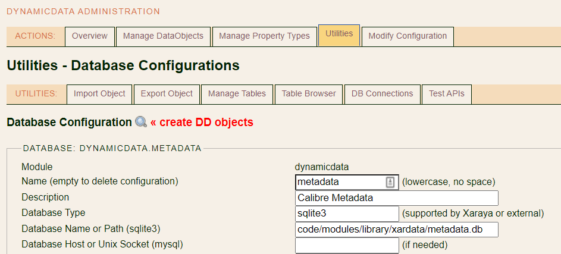

# Dynamic Data Objects

This describes some recent features in the Dynamic Data module and how to use them:

- [Table Object Descriptor](#table-object-descriptor)
- [Database Connections](#database-connections)
- [Import PHP Definitions](#import-php-definitions)
- [DD Without Xaraya Core](#dd-without-xaraya-core)
- [Generated Classes](#generated-classes)

## Table Object Descriptor

This allows you to create a virtual table object on the fly for any table in the Xaraya DB (if it has a primary key).

In the past, this was available in limited fashion within the DD admin interface itself, but it was "bolted on" and stopped working quite a while ago.

See **Dynamic Data > Utilities > Table Browser** > View any table

Example:
```
// use the standard DataObjectMaster methods with 'table' => ... args
$objectlist = DataObjectFactory::getObjectList(['table' => 'xar_eventsystem']);
$items = $objectlist->getItems();

// or create a virtual table object for some table in the Xaraya DB
$descriptor = new TableObjectDescriptor(['table' => 'xar_eventsystem']);
$objectlist = new DataObjectList($descriptor);
//...use the DD objectlist or object as usual
$items = $objectlist->getItems();
```

This is now available anywhere that relies on `DataObjectFactory::getObject()` or `DataObjectFactory::getObjectList()`, whenever the `table` parameter is passed along without `objectid` or `name`.

*Note: existing API functions or BL tags may pre-process some of these already, e.g. by adding DB prefix in xar:data-view and dynamicdata_userapi_showview(), so this may not work everywhere in Xaraya as is. They were not adapted yet, as that might have side-effects for other modules or sites relying on them today.*

## Database Connections

By default, DD objects will use datastores with relational tables or xar_dynamic_data from the Xaraya DB, calling `xarDB::getConn()` without parameter (default `dbConnIndex = 0`).

Now you can define another database connection in your module or script, and configure the DD object to use that connection instead.
See https://github.com/xaraya-modules/library module for an example connecting to sqlite3 databases.

There are 3 main use cases:
- predefined database connections
- database connections on demand
- external database connections

### Predefined database connection

The first case is when you fully control when & where the DD object is used, and you predefine the database connection.

In that case, you only need to configure the DD object with `dbConnIndex` to match whatever database connection you created up-front.

Example:
```
// specify database parameters
$args = [
    'databaseType' => 'sqlite3',
    'databaseName' => 'var/sqlite/metadata.db',
    // ...other parameters for mysqli
];
// create new database connection
$conn = xarDB::newConn($args);
// get the latest connection index
$dbConnIndex = xarDB::getConnIndex();

// get an existing DD object or create a virtual one, and pass along the dbConnIndex
$descriptor = new TableObjectDescriptor(['table' => 'books', 'dbConnIndex' => $dbConnIndex]);
$objectlist = new DataObjectList($descriptor);
//...use the DD objectlist or object as usual
$items = $objectlist->getItems();

```

This is OK for predefined scenarios where the order of creating database connections and DD objects is well-known, like in a specific module function or job scheduling script.

### Database connection on demand

In cases where you have several modules and/or DD objects each with their own database connections, the scenario above may not be enough.

For DD objects, next to the `dbConnIndex` parameter above, you can also pass along its database connection arguments via `dbConnArgs`. These may be the same for all DD objects belonging to a module, or even specific to each DD object if that makes sense.

What's inside the `dbConnArgs` parameter? In principle, all the database arguments needed to start a new database connection with `xarDB::newConn($this->dbConnArgs)`, so something like the following array:

```
// specify database parameters
$dbConnArgs = [
    'databaseType' => 'sqlite3',
    'databaseName' => 'var/sqlite/metadata.db',
    // ...other parameters for mysqli
];
```

In practice, we don't want to store all this configuration for each DD object, especially if it contains sensitive information like username and password for MySQL databases. And we'd also prefer to have 1 place where all database connections are defined (per module), rather than to have to maintain this for every DD object individually.

So the best approach for now is to specify an existing database configuration (see [External database connections](#external-database-connections)), or use a `callable` function as `dbConnArgs`, something like:
```
// specify existing database configuration
$dbConnArgs = ['databaseConfig' => 'dynamicdata.testdb'];

// or specify callable to get database parameters
$dbConnArgs = [ UserApi::class, 'getDbConnArgs' ];

// this will call $dbConnArgs = UserApi::getDbConnArgs($object) for each DD object on demand
```

That way, you can have specific database connections for all DD objects in your module, or for individual objects as you prefer, without storing the database credentials. And you have the possibility of switching databases as needed, e.g. for the current database per user.

An example of this is in the https://github.com/xaraya-modules/library module, where you can define several Calibre databases (using the same table structure), and each user can select their current database and browse through it using the same DD objects and callable `dbConnArgs`.

Practical note: to save `dbConnArgs` as part of the DD object config and show it correctly in the DD admin interface, it must be json-encoded first before it is serialized:
```
use Xaraya\Modules\Library\UserApi;

$config = [
    'dbConnIndex' => 1,
    'dbConnArgs' => json_encode([UserApi::class, 'getDbConnArgs'])
];
$args = [
    // ...
    'config' => serialize($config),
];
```

If this all sounds difficult, you can actually use the core [Database Trait](../../../lib/xaraya/traits/README.md#database-trait) for easily re-usable `UserApi::getDbConnArgs()`, managing the databases per module, and support for current database per user.

Example:
```
namespace Xaraya\Modules\Library;

use Xaraya\Core\Traits\DatabaseInterface;
use Xaraya\Core\Traits\DatabaseTrait;
use sys;

sys::import('xaraya.traits.databasetrait');

class UserApi implements DatabaseInterface
{
    use DatabaseTrait;
    protected static string $moduleName = 'library';
}
```

What's left **to do** in your module is: see https://github.com/xaraya-modules/library
1. define the database(s) at module init (or afterwards)
2. have a UserApi class using the Database Trait as shown above
3. define your DD objects with the right config (*)
4. do something with these DD objects in your user interface :-)

(*) if you're not using composer autoload, your DD objects will need to use a custom class that extends DataObject and provides the import of the right UserApi class, like https://github.com/xaraya-modules/library/blob/main/class/object.php

You'll specify the class and filepath as part of the object definition:
```
$object = [
    // ...
    'class' => 'Xaraya\\Modules\\Library\\LibraryObject',
    'filepath' => 'modules/library/class/object.php',
    // ...
];
```

The good news is that when you do that, you can also add some custom action methods, and/or override a standard DD method as you prefer - like adding an "Action!" link as view option to borrow a book or whatever :-)

### External database connections

In some cases you may want to bypass Xaraya's database connections altogether, and use external DB drivers like those of Doctrine DBAL or MongoDB. For example when the data you want to use is stored in a database that's not supported by Creole/PDO, or perhaps because you need some specific features available only from that external DB driver. This functionality is provided by the new `ExternalDatabase` class, which replaces `xarDB_Creole` or `xarDB_PDO` to open database connections via the external DB driver.

To use this for DD objects you can set an `external` value in the `dbConnArgs` parameter above:
```
// specify database parameters
$dbConnArgs = [
    //'external' => 'dbal',
    'external' => 'mongodb',
    // ...other parameters for dbal or mongodb
];
```

This will tell DD to use an `ExternalDatastore` instead of the regular relational or variabletable datastore. It supports all the standard getItem, getItems(*), createItem, updateItem, deleteItem operations for datastores that DD objects use internally, but does this via an `ExternalDatabase` connection specified by the `dbConnArgs` parameter.

(*) for getItems() not all features are supported yet

See **Dynamic Data > Utilities > DB Connections** > select or add a database to configure

### Create DD objects for database tables

Once you have defined a database configuration, you can also create DD objects for all/selected tables in that database.



## Import PHP Definitions

Xaraya has been using XML definition files for DD objects for years. Why suddenly support another way of defining DD objects using PHP files?

Good question. Because we can, is probably not the best answer...

Besides any preference for XML vs. JSON vs. YAML and so on for configurations, using PHP files came from experimenting with virtual DD objects (like the table object above), and the wish to re-create many objects on the fly as efficiently as possible. That in combination with the standard use of `opcache` in most modern PHP installations led to the conclusion that using PHP files would be the best way to do this - the same way we're using PHP files to cache compiled template files today.

By itself there's not much difference in using PHP definition files instead of XML files, especially for one-time use to create DD objects in the Xaraya DB at module initialization. However, they become more interesting if we want to use them on the fly, which leads us to the next point...

## DD Without Xaraya Core

By design and history, Xaraya relies on its database for everything, from available modules and themes to creating DD objects and properties, before we even get to retrieving the data we want to show.

For a complex web application, that makes sense, but for special use cases like REST or GraphQL API, the table object above or experiments like [bridging](../../../lib/xaraya/bridge/README.md) with other PHP packages, having to rely on the full Xaraya core load and database for each request becomes ... inefficient and bothersome.

The `VirtualObjectDescriptor` (parent of the `TableObjectDescriptor`) is one part of the puzzle to achieve this, along with the need to get its configuration from somewhere (you guessed it: PHP definition files), and some judicious/dubious core cache loading that's still a bit of a work in progress.

The result can be quite interesting, at least in this early stage

```
For the creation of 5.000 DD objects:

Profile: Normal baseline
Elapsed: 4.588 sec - Memory: 384.0 MB - Count: 5000

Profile: Normal unserialize
Elapsed: 0.459 sec - Memory: 398.0 MB - Count: 5000

Profile: Normal clone
Not supported for DataObject()

Profile: Generated baseline
Elapsed: 0.121 sec - Memory: 2.0 MB - Count: 5000

Profile: Generated unserialize
Elapsed: 0.035 sec - Memory: 4.0 MB - Count: 5000

Profile: Generated clone
Elapsed: 0.011 sec - Memory: 0.0 MB - Count: 5000
```

That's before we retrieve the first itemid from the database. There is a *huge* difference between normal and generated baseline, and still a *large* one even when using caching with the normal unserialize.

When we retrieve the first itemid, the difference becomes less noticeable as the database load increases, but it's still interesting

```
Profile: Normal baseline
Elapsed: 5.438 sec - Memory: 386.0 MB - Count: 5000

Profile: Normal unserialize
Elapsed: 1.876 sec - Memory: 606.0 MB - Count: 5000

Profile: Generated baseline
Elapsed: 1.028 sec - Memory: 0.0 MB - Count: 5000
```

## Generated Classes

This part is purely an experiment for now, but it builds on the previous topics. If you try to Export in PHP format in DD Utilities, or have a closer look at the [generated Sample](./class/generated/Sample.php) class, you'll see a PHP class that is generated with PHP properties mapped to the DD properties of the underlying DD Sample object.

The idea was to see how useful this could be compared to the normal DD object way of working - and so far, the conclusion is not very :-(

Why is this relevant here? Because when you instantiate that class, it generates the underlying DD Sample object on the fly based on everything above - and that's how you got these benchmarks :-)

You will find various tests about all this under [developer/tests/virtual/](../../../../developer/tests/virtual/).

To be continued (or dropped) at a later time...
