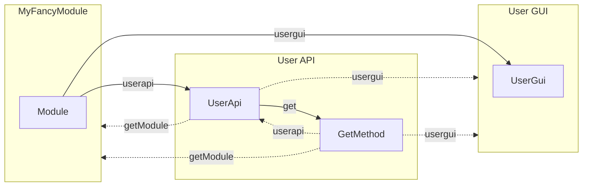

# Xaraya Modules

The `xarMod` class is the main interface for modules in Xaraya core.

Module functions are organised by type (gui or api) and name, and they are invoked via `xar::mod()->guiFunc()` or `xar::mod()->apiFunc()`. Typical types are user, userapi, admin and adminapi, but other types are used in various modules too.

## Module Functions (traditional)

Existing modules will use procedural functions `module_type_name($args, $context)`.

For smaller modules, functions can be combined in a single file by type:

html/code/modules/myfancymodule
- xaradmin.php -> myfancymodule_admin_\*($args, $context)
- xaradminapi.php -> myfancymodule_adminapi_\*($args, $context)
- xaruser.php -> myfancymodule_user_\*($args, $context)
- xaruserapi.php -> myfancymodule_userapi_\*($args, $context)
- xarinit.php -> myfancymodule_\*(*) [1]

[1] called by modules_adminapi_executeinitfunction() in modules admin gui

For larger modules, functions will be in separate files by type and name:

html/code/modules/myfancymodule
- xaradmin
  * main.php -> myfancymodule_admin_main($args, $context)
  * modifyconfig.php
- xaradminapi
  * create.php -> myfancymodule_adminapi_create($args, $context)
  * delete.php
- xaruser
  * main.php -> myfancymodule_user_main($args, $context)
  * view.php
- xaruserapi
  * get.php -> myfancymodule_userapi_get($args, $context)
  * getall.php
- xarinit.php -> myfancymodule_\*(*) [1]

Module functions use a naming convention for the function type: '' for gui functions and 'api' for api functions.

## Module Methods (object-oriented)

Newer modules can use class methods instead of procedural functions. They can be invoked via the traditional `xar::mod()->guiFunc()` or `xar::mod()->apiFunc()`, or by getting a *module class* via `xar::module()` and then using method calls to get the right component and method(s).

Each module has a central module handler class, and *component classes* per type with their own methods. 
Short-hand methods like `xar::mod()->userapi()` and `xar::mod()->usergui()` are available to get common components by module.
You can also get a callable to a module method directly via `xar::module()->getCallableMethod()`.

For smaller modules, methods can be combined in a single component class file by type:

html/code/modules/myfancymodule
- module.php -> Xaraya\Modules\MyFancyModule\Module()
- admingui.php -> Xaraya\Modules\MyFancyModule\AdminGui()->\*($args)
- adminapi.php -> Xaraya\Modules\MyFancyModule\AdminApi()->\*($args)
- usergui.php -> Xaraya\Modules\MyFancyModule\UserGui()->\*($args)
- userapi.php -> Xaraya\Modules\MyFancyModule\UserApi()->\*($args)
- installer.php -> Xaraya\Modules\MyFancyModule\Installer()->\*(*) [1]

For larger modules, methods will be in separate class files by type and name:

html/code/modules/myfancymodule
- module.php -> Xaraya\Modules\MyFancyModule\Module()
- admingui.php -> Xaraya\Modules\MyFancyModule\AdminGui()
- adminapi.php -> Xaraya\Modules\MyFancyModule\AdminApi()
- usergui.php -> Xaraya\Modules\MyFancyModule\UserGui()
- userapi.php -> Xaraya\Modules\MyFancyModule\UserApi()
- installer.php -> Xaraya\Modules\MyFancyModule\Installer()->\*(*) [1]
- admingui
  * main.php -> Xaraya\Modules\MyFancyModule\AdminGui\MainMethod($args)
  * modifyconfig.php
- adminapi
  * create.php -> Xaraya\Modules\MyFancyModule\AdminApi\CreateMethod($args)
  * delete.php
- usergui
  * main.php -> Xaraya\Modules\MyFancyModule\UserGui\MainMethod($args)
  * view.php
- userapi
  * get.php -> Xaraya\Modules\MyFancyModule\UserApi\GetMethod($args)
  * getall.php

Module methods rely on component class interfaces for the function type: `GuiMethodsInterface` for gui methods and `ApiMethodsInterface` for api methods. Api methods cannot be called as gui functions via `xar::mod()->guiFunc()`.

Note: the `$context` is handled by the class itself, and does not need to be passed to the method call here.



## Implementation Details

Module developers can use the traits and classes in `html/lib/xaraya/modules/` to easily start new modules and/or migrate existing module functions to module methods.

### Module Class

```php
# module.php

namespace Xaraya\Modules\MyFancyModule;

use Xaraya\Modules\ModuleClass;
use sys;


/**
 * Get myfancymodule module classes via xar::module()
 */
class Module extends ModuleClass
{
    public function setClassTypes(): void
    {
        parent::setClassTypes();
        // add 'import' class type for this module
        $this->classtypes['import'] = 'Import';
    }
}
```

### Component Classes

If you want to start from scratch, you can use basic component traits and interfaces here:

```php
# userapi.php

namespace Xaraya\Modules\MyFancyModule;

use Xaraya\Modules\UserApiInterface;
use Xaraya\Modules\UserApiTrait;
use sys;


/**
 * Handle module user api functions
 */
class UserApi implements UserApiInterface
{
    /** @use UserApiTrait<Module> */
    use UserApiTrait;
}
```

Component classes can also extend `UserApiClass` etc. instead of implementing `UserApiInterface` and using `UserApiTrait`:

```php
# userapi.php
namespace Xaraya\Modules\MyFancyModule;

use Xaraya\Modules\UserApiClass;
use sys;


/**
 * Handle module user api functions
 * @extends UserApiClass<Module>
 */
class UserApi extends UserApiClass
{
    // ...
}
```

If your module handles DD objects, you may want to start from DD component traits:

```php
# userapi.php

namespace Xaraya\Modules\MyFancyModule;

use Xaraya\Modules\DynamicData\Traits\UserApiInterface;
use Xaraya\Modules\DynamicData\Traits\UserApiTrait;
use sys;


/**
 * Handle (traditional) DD user api functions via module class
 * Note: this does not replace the direct use of object methods
 */
class UserApi implements UserApiInterface
{
    /** @use UserApiTrait<Module> */
    use UserApiTrait;
}
```

Module methods can be added directly in the component class:

```php
# userapi.php

// ...

class UserApi extends UserApiClass
{
    // ...

    public function get(array $args = [])
    {
        // get single module item
        // $context = $this->getContext();
        return $data;
    }
}

```

### Method Classes (optional)

For larger modules, you can split off each module method into its own method class:

```php
# userapi/get.php

namespace Xaraya\Modules\MyFancyModule\UserApi;

use Xaraya\Modules\MyFancyModule\UserApi;
use Xaraya\Modules\MethodClass;
use sys;


/**
 * myfancymodule userapi get function
 * @extends MethodClass<UserApi>
 */
class GetMethod extends MethodClass
{
    public function __invoke(array $args = [])
    {
        // get single module item
        // $context = $this->getContext();
        // call other methods from the UserApi() class via ->userapi() here
        // $other = $this->userapi()->other();
        return $data;
    }
}
```

## Migrating Existing Modules

The `developer/tools/bermuda_cleanup.php` tool has a new `XarayaModuleMigrator()` class to create the module classes and help migrate the installer and all standard module functions.

```php
$inDir = dirname(__DIR__, 2) . '/vendor/xaraya/';
$migrator = new XarayaModuleMigrator($inDir, true);
$migrator->verbose = true;
$migrator->load_project();
$migrator->parse_project();
$refresh = false;
$migrator->migrate_installer_functions($refresh);
$migrator->migrate_module_functions('userapi', $refresh);
// ...
```

You will still need to verify any errors in your IDE for missing use ... statements etc., but it does the heavy lifting for you...
